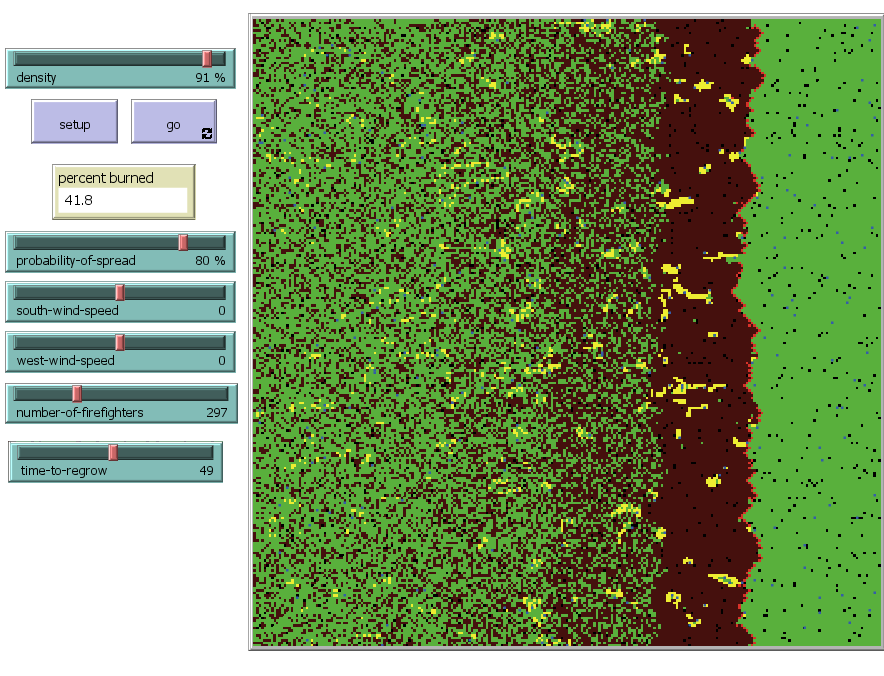
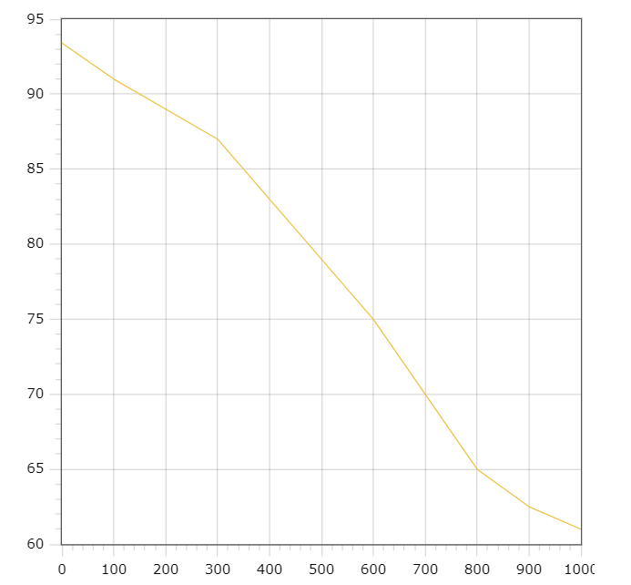

## Комп'ютерні системи імітаційного моделювання
## СПм-22-3, **Гриценко Іван Костянтинович**
### Лабораторна робота №**2**. Редагування імітаційних моделей у середовищі NetLogo

 

### Варіант 5, модель у середовищі NetLogo:
[Fire Simple Extension 2](http://www.netlogoweb.org/launch#http://www.netlogoweb.org/assets/modelslib/IABM%20Textbook/chapter%203/Fire%20Extensions/Fire%20Simple%20Extension%202.nlogo)

 

### Внесені зміни у вихідну логіку моделі, за варіантом:

**Створення активних агентів** На ігровому полі попередньо складавшомуся тількі з патчей додали активних агентів пожежних
<pre>
breed [firefighters firefighter]
</pre>
У процедурі setup додали код який розміщує пожежних агентів на пусті місця (патчі початково не зайняті лісом та вогнем). Кількість агентів задається користувачем і відповідно має назву number-of-firefighters
<pre>
  create-firefighters number-of-firefighters [
    let empty-patches patches with [pcolor != green or pcolor != red]
    let random-empty-patch one-of empty-patches
    move-to random-empty-patch
    set color blue  ;;
  ]
</pre>

У процедурі go були додані зміни відповідаючі за гасіння дерева. З розсуду автора погашене дерево окрашується в жовтий колір, для наглядності. 

<pre>
  ask firefighters [
   if any? neighbors with [pcolor = red] [
     let fire-patch neighbors4 with [pcolor = red]
     set pcolor yellow
     ask fire-patch [set pcolor yellow]
   ]
 ]
</pre>

Також був доданий блок якій програмує рух пожежників на одну з можливих для переміщення клітин :

<pre>

    ask firefighters [
    let possible-moves neighbors4 with [member? pcolor [green black]]
    if any? possible-moves [
      move-to one-of possible-moves
    ]
  ]
</pre>

### Внесені зміни у вихідну логіку моделі, на власний розсуд:

**Додано функціональність відновлення лісу**.
Користувач може задати відповідний час, що представляє собою кількість тіків через яку на місті спаленого лісу можуть випадковим чином з'явитися нові дерева. Створення нового лісу відбуваєтсья у доданій процедурі

<pre>
to regrow-trees
  ask n-of (initial-trees - count patches with [pcolor = green]) patches with [pcolor != red] [
    set pcolor green
  ]
end
</pre>

При цьому у процедурі go встановлено імітацію таймера, який насправді оперує поточною кількістю тіків :

<pre>
    ;; Check for regrowth of trees
  if ticks mod time-to-regrow = 0 [
    regrow-trees
  ]
</pre>

 

Модель була доповнена двома слайдерами які відповідно регулюють одноіменні показники віконяння програми. Кінцевий інтерфейс і варіант виконання програми представлений на зображенні:

 

## Обчислювальні експерименти

### 1. Залежність кінцевої кількості згорівшого лісу від кількості пожежних

Досліджується залежність кінцевого показнику часу роботи програми від кількості заданих пожежних агентів. Час симуляції визначає кількість тактів.
Експерименти проводяться при 0-1000 відсодках вірогідності, з кроком 100, усього 11 симуляцій.  
Інші керуючі параметри мають значення за замовчуванням:
- **density**: 80
- **south-wind-speed**: 05
- **west-wind-speed**: 0
- **time-to-grow**: 1000
- **probability-of-spread**: 75

<table>
<thead>
<tr><th>Кількість пожежних</th> <th>Кінцевий відсоток згорівших дерев</th></tr>
</thead>
<tbody>
<tr><td>0</td><td>93.4</td></tr>
<tr><td>100</td><td>91</td></tr>
<tr><td>200</td><td>89</td></tr>
<tr><td>300</td><td>87</td></tr>
<tr><td>400</td><td>83</td></tr>
<tr><td>500</td><td>79</td></tr>
<tr><td>600</td><td>75</td></tr>
<tr><td>700</td><td>70</td></tr>
<tr><td>800</td><td>65</td></tr>
<tr><td>900</td><td>62.5</td></tr>
<tr><td>1000</td><td>61</td></tr>
</tbody>
</table>

 

Графік наочно показує, що для кінцева кількість спалених дерев залежить від кількості пожежних. Кількість пожежних рівномірно знижує кількість кінцево спаленого лісу.